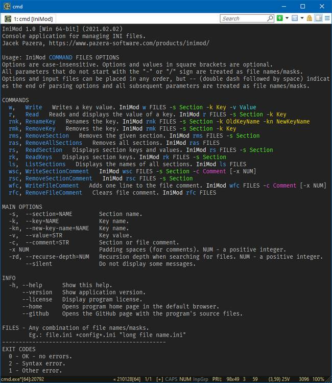

# IniMod

- [IniMod](#inimod)
	- [Overview](#overview)
	- [Screenshot](#screenshot)
	- [Download](#download)
	- [Usage](#usage)
		- [Commands](#commands)
		- [Options](#options)
		- [FILES](#files)
		- [Exit codes](#exit-codes)
	- [Hints](#hints)
	- [License](#license)
	- [Note](#note)
	- [Compilation](#compilation)
	- [Releases](#releases)

## Overview

Console application for managing INI files.

The program allows you to perform basic operations on INI files, such as saving and reading key values, creating and deleting sections, renaming and deleting keys, adding and removing a file comment and section comment, etc.

## Screenshot

## Download

Source: https://github.com/jackdp/IniMod

Compiled binaries (32 & 64-bit for Windows and Linux): https://www.pazera-software.com/products/inimod/

## Usage

`IniMod COMMAND FILES OPTIONS`

Options are case-insensitive. Options and values in square brackets are optional.  
All parameters that do not start with the `-` or `/` sign are treated as file names/masks.  
Options and input files can be placed in any order, but `--` (double dash followed by space) indicates the end of parsing options and all subsequent parameters are treated as file names/masks.

### Commands

| Command                       | Description                            | Usage                                                      |
|-------------------------------|----------------------------------------|------------------------------------------------------------|
| `w`,   `Write`                | Writes a key value.                    | IniMod32 w FILES -s Section -k Key -v Value                |
| `r`,   `Read`                 | Reads and displays the value of a key. | IniMod32 r FILES -s Section -k Key                         |
| `rnk`, `RenameKey`            | Renames the given key.                 | IniMod32 rnk FILES -s Section -k OldKeyName -kn NewKeyName |
| `rmk`, `RemoveKey`            | Removes the key.                       | IniMod32 rmk FILES -s Section -k Key                       |
| `rms`, `RemoveSection`        | Removes the given section.             | IniMod32 rms FILES -s Section                              |
| `ras`, `RemoveAllSections`    | Removes all sections.                  | IniMod32 ras FILES                                         |
| `rs`,  `ReadSection`          | Displays section keys and values.      | IniMod32 rs FILES -s Section                               |
| `rk`,  `ReadKeys`             | Displays section keys.                 | IniMod32 rk FILES -s Section                               |
| `ls`,  `ListSections`         | Displays the names of all sections.    | IniMod32 ls FILES                                          |
| `wsc`, `WriteSectionComment`  | Adds one line to the section comment.  | IniMod32 wsc FILES -s Section -c Comment [-x NUM]          |
| `rsc`, `RemoveSectionComment` | Clears section comment.                | IniMod32 rsc FILES -s Section                              |
| `wfc`, `WriteFileComment`     | Adds one line to the file comment.     | IniMod32 wfc FILES -c Comment [-x NUM]                     |
| `rfc`, `RemoveFileComment`    | Clears file comment.                   | IniMod32 rfc FILES                                         |
  
### Options

| Option                       | Description                                                         |
|------------------------------|---------------------------------------------------------------------|
| `-s`,  `--section=NAME`      | Section name.                                                       |
| `-k`,  `--key=NAME`          | Key name.                                                           |
| `-kn`, `--new-key-name=NAME` | Key name.                                                           |
| `-v`,  `--value=STR`         | Key value.                                                          |
| `-c`,  `--comment=STR`       | Section or file comment.                                            |
| `-x NUM`                     | Padding spaces (for comments). NUM - a positive integer.            |
| `-rd`, `--recurse-depth=NUM` | Recursion depth when searching for files. NUM - a positive integer. |
| `--silent`                   | Do not display some messages.                                       |
| `-h`, `--help`               | Show this help.                                                     |
| `--examples`                 | Display examples.                                                   |
| `-V`, `--version`            | Show application version.                                           |
| `--license`                  | Display program license.                                            |
| `--home`                     | Opens program homepage in the default browser.                      |
| `--github`                   | Opens the GitHub page with the program's source files.              |

### FILES

Any combination of file names/masks.  
Eg.: `file.ini` `*config*.ini` `"long file name.ini"`

### Exit codes

| Exit code | Description   |
|-----------|---------------|
| 0         | OK (no error) |
| 1         | Other error   |
| 2         | Syntax error  |

## Hints

INI files are saved using **UTF-8** encoding.

To create a **new section**, run the program with the `Write` command and specify the name of the desired section. If this section does not exist in the INI file, it will be created automatically.

All lines in INI files that start with the character `;` are comments.

The **file comment** is the comment before the first section.  
Each time the program is run with the `WriteFileComment` command, one line is added to the end of the current file comment.

A **section comment** is between the section name and the first section key.  
Each run of the program with the `WriteSectionComment` command adds one line to the end of the current comment for the specified section.

## License

**Public domain**. You can do with my code and compiled binaries whatever you want without any limitations.

## Note

I wrote this program many years ago for my own use. I use it very often, maybe it will also be useful to someone.

## Compilation

To compile, you need the [Lazarus IDE](https://www.lazarus-ide.org/) with the [Free Pascal Compiler (FPC)](https://freepascal.org/) **3.2.0** (or newer) and several units from the [JPLib](https://github.com/jackdp/JPLib) package.

How to build:

1. Open and build **JPLib** package in the Lazarus IDE.
2. Open the project file: `src\IniMod.lpi`.
3. Build project (menu `Run->Build`).

## Releases

2021.02.02 - Version 1.0
